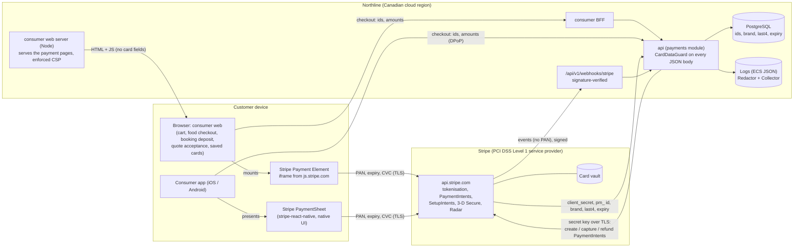

# Cardholder data flow (S-110)

Northline is a **card-not-present merchant that never receives cardholder data**. Every card number, expiry and
security code is typed into a Stripe-hosted field and goes from the customer's device straight to Stripe. Northline's
servers see Stripe object ids (`pi_…`, `pm_…`, `seti_…`, `cus_…`, `ch_…`), the card brand, the last four digits and
the expiry month and year. Without the number, those are not cardholder data under PCI DSS. This is what makes
Northline eligible for SAQ A ([saq-a.md](saq-a.md)).

## Diagram

## What crosses each arrow

| from → to | carries | never carries | controls |
|---|---|---|---|
| customer → Stripe (Payment Element, PaymentSheet) | PAN, expiry, CVC, 3-D Secure challenge | — (this is the only place card data flows) | Stripe's iframe / native SDK; TLS 1.2+; CSP `frame-src` and `script-src` allow only Stripe |
| consumer web server → browser | the pages, the app bundle, the policy headers | card fields of our own | enforced CSP on both (consumer: generated from the script inventory, reports to `/csp-report`); [payment-page-scripts.md](payment-page-scripts.md) |
| browser / app → BFF → api | cart, checkout, the PaymentIntent and PaymentMethod ids, the step-up proof | PAN, CVC, track data | `CardDataGuard` refuses any JSON body that carries them (422 `card_data`) |
| api → Stripe | amounts, currency, customer id, metadata (`northline_*` ids), idempotency keys | personal data beyond the Stripe Customer's `northline_user_id` | pinned API version, restricted key preferred, TLS ([stripe-review.md](stripe-review.md)) |
| Stripe → api (responses, webhooks) | object ids, statuses, brand, last4, expiry, billing details on some objects | full PAN or CVC (Stripe never returns them) | signature verification, 5-minute tolerance, dedupe; personal fields dropped before storage (`StripeEventStore`) |
| api → database | `payments.customer_cards` (brand, last4, exp month/year, default), `payments.payment_intents` (ids, states), `payments.stripe_events` (redacted payloads) | PAN, CVC, track data, PIN | `CardDataScanTest` (schema names, every value of every column) |
| every app → logs | redacted structured lines | PAN (masked `[CARD …4242]`), CVC (`[REDACTED]`), track data (`[TRACK]`) | Redactor (S-112, S-110 additions), Collector `transform/redact`, `CardDataRegressionTest` |

## Systems in and out of scope

- **In scope for SAQ A** (they can affect the security of the payment page): the consumer web server and its edge
  (Envoy Gateway, TLS, headers), the build and deploy pipeline of the consumer web image, the Stripe dashboard accounts,
  and the people with access to them.
- **Out of the cardholder data environment** (no account data): the api, BFFs, worker, databases, Kafka, Elasticsearch,
  object storage, logs. The guard and the scanners are the evidence that this stays true.
- **Studio** (merchants): no card entry. It loads Stripe.js for Connect onboarding, Identity and Financial Connections
  (bank linking — bank account data goes to Stripe, Northline stores the last four only). Its CSP is enforced.
- **Consumer app**: card entry only in Stripe's PaymentSheet (native UI, outside the app's JavaScript). 3-D Secure
  returns through `ca.northline.app://stripe-redirect` and carries no card data.
- **Courier app**: no payments.

## Where each flow is in the code

- Web: `web/apps/consumer/src/features/cart/Payment.tsx` (cart and food checkout), `features/booking/StripeCard.tsx`
  (booking deposit and quote acceptance), `features/account/CardForm.tsx` (saved cards, `confirmSetup`). Without
  Stripe configured (the `local` profile) they show a read-only stand-in and collect nothing.
- App: `mobile/apps/consumer/src/shop/payments.ts`, `src/services/stripe.native.ts`, `src/account/cardSetup.ts`
  (PaymentSheet only), `app/stripe-redirect.tsx`.
- api: `payments/api/PaymentAuthorizations` (PaymentIntent and client secret), `payments/infra/StripeSavedCards`
  (SetupIntents; brand, last4, expiry), `payments/web/StripeWebhookController` + `StripeSignatureVerifier`,
  `shared/web/CardDataGuard`.
